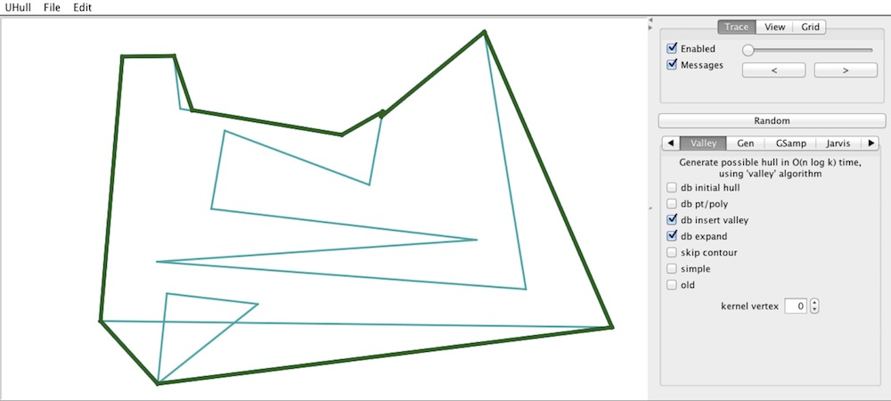

Guaranteed and Possible Hulls
===========

This Java program was used to develop and demonstrate the algorithms 
discussed in Chapter 3 of my [Ph.D. dissertation](https://circle.ubc.ca/handle/2429/38084).

The program can be run as an application; its main class is uhull.UHullMain.class.
It can also be run as an applet, by loading the page "Applet.html" within a browser
(or from the command line: "appletviewer Applet.html").

